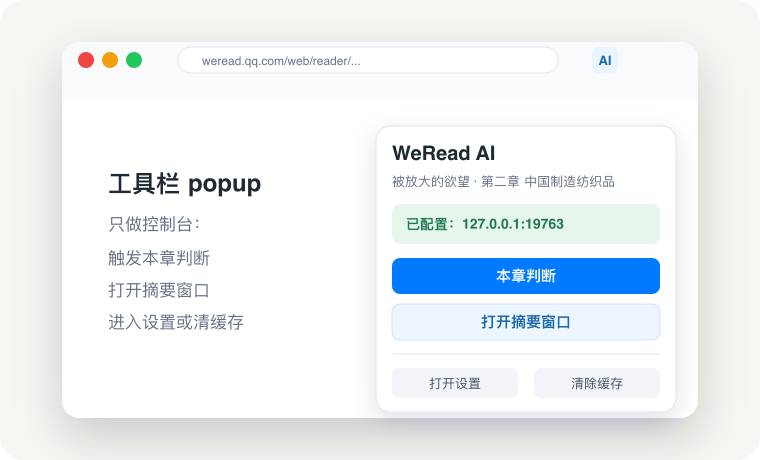
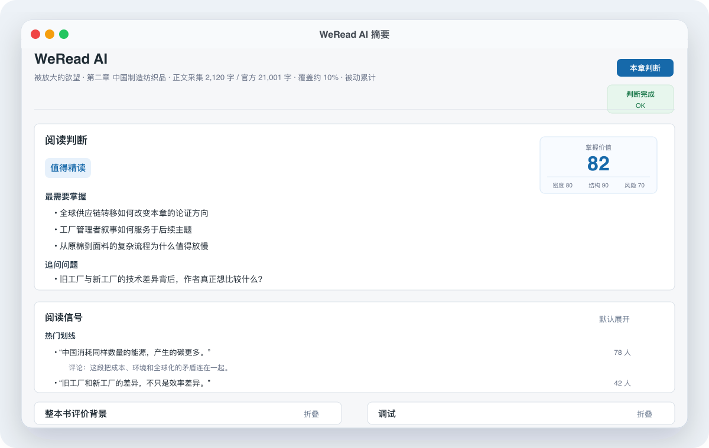
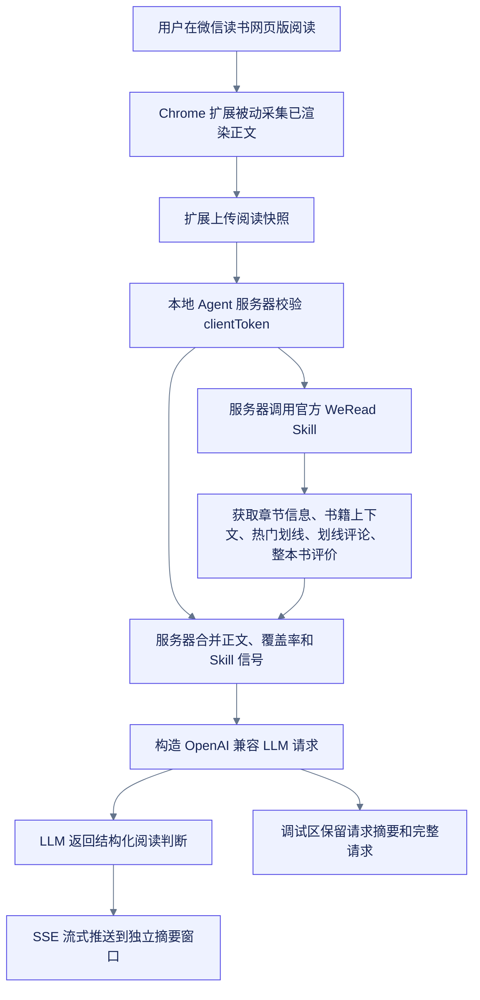

# WeRead AI Reader

微信读书网页版的实时 AI 跟读助手。当前形态是：Chrome 扩展负责被动采集阅读现场，本地 Agent 服务器负责调用官方 WeRead Skill 和 OpenAI 兼容 LLM，独立 AI 摘要窗口负责展示本章阅读判断。

## 当前界面

阅读页内不再注入可见 AI 小框，避免遮挡正文或压缩阅读区域。常用操作分布在三个地方：

| 界面 | 负责什么 |
| --- | --- |
| Chrome 工具栏 popup | 打开或聚焦摘要窗口、刷新阅读判断、打开设置、清除本地缓存 |
| 独立 AI 摘要窗口 | 常驻展示阅读判断、采集上下文、当前章节阅读信号、整本书评价背景和调试信息 |
| 设置页 | 配置 Agent Server URL 和 `clientToken` |






这些截图是可维护示意图，源文件在 `docs/images/*.svg`，PNG 由 SVG 导出。更新截图后可用：

```bash
rsvg-convert -w 760 -h 460 docs/images/toolbar-popup.svg -o docs/images/toolbar-popup.png
rsvg-convert -w 1200 -h 760 docs/images/summary-window.svg -o docs/images/summary-window.png
rsvg-convert -w 1000 -h 640 docs/images/options-page.svg -o docs/images/options-page.png
```

摘要窗口的首屏重点是“接下来怎么读”：

- 必须精读/值得精读/可快读/可跳读结论。
- 掌握价值总分，以及内容增量、结构关键、精读必要三维分。
- 最多 3 个最需要掌握点。
- 最多 2 个带着读的问题，不生成答案。
- 一句服从结论的阅读动作；可快读结论下只能建议局部精读，不能要求整章必须精读。
- Agent 归纳出的读者视角、理由和重点段落。

头部的采集上下文显示书名、章节、已采集正文字数、官方章节字数、覆盖率和采集方式。“阅读信号”只放当前章节 WeRead 公共信号：热门划线、划线评论和告警。“整本书评价背景”和“调试”默认折叠。

## 它如何工作



官方 WeRead Skill 能拿到书籍信息、阅读进度、热门划线、划线评论和书评，但拿不到当前章节正文。Chrome 扩展补上浏览器侧自然渲染出的正文快照。扩展不会为了全章采集自动滚动、翻页或跳章节；覆盖率不足时，Agent 应明确给出阶段性建议。

掌握价值总分不由模型自由给出。服务端按固定权重从三维分派生：

- 内容增量：35%
- 结构关键：40%
- 精读必要：25%

精读门槛也由服务端统一约束：`90-100` 为必须精读，`80-89` 为值得精读，`65-79` 为可快读，`0-64` 为可跳读。

## 快速启动

准备条件：

- Node.js 18 或更新版本
- Chrome
- 微信读书网页版登录态
- 官方 WeRead Skill API Key
- OpenAI 兼容 LLM API Key

推荐用 `.env` 加一键脚本启动。第一次运行脚本时，如果没有 `.env` 且当前 shell 没有导出必需变量，会自动从 `.env.example` 创建模板。

```bash
cp .env.example .env
```

至少填入：

```bash
WEREAD_API_KEY=wrk-...
LLM_API_KEY=sk-...
```

`.env.example` 默认使用 OpenCode Go 兼容接口和 `mimo-v2.5`：

```bash
LLM_API_BASE=https://opencode.ai/zen/go/v1
LLM_MODEL=mimo-v2.5
LLM_FALLBACK_MODELS=kimi-k2.6,kimi-k2.5
CLIENT_TOKEN=dev-token
PORT=19763
```

如果你已经在 shell、zsh 配置或其它全局环境里导出了 `WEREAD_API_KEY` 和 `LLM_API_KEY`，本机启动不强制要求项目根目录存在 `.env`。同名的非空导出变量会优先于 `.env` 文件里的值。

本机启动：

```bash
./scripts/start-server.sh
```

Docker 启动：

```bash
./scripts/start-server.sh --docker
```

npm 快捷命令：

```bash
npm run server
npm run server:docker
```

健康检查：

```bash
curl http://127.0.0.1:19763/health
```

## 安装扩展

1. 打开 `chrome://extensions`。
2. 开启开发者模式。
3. 点击“加载已解压的扩展程序”。
4. 选择本仓库的 `extension/` 目录。
5. 打开扩展设置页，填写 Agent 服务器地址和 `CLIENT_TOKEN`。

本地默认地址是 `http://127.0.0.1:19763`，默认开发令牌是 `dev-token`。如果服务器环境变量里改了 `CLIENT_TOKEN`，扩展设置页也要同步修改。

## 使用方式

1. 打开微信读书网页版阅读页，例如 `https://weread.qq.com/web/reader/...`。
2. 点击 Chrome 工具栏里的 WeRead AI 扩展图标。
3. 在 popup 中点击“打开摘要窗口”，或按 `Option+Q` 打开独立 AI 摘要窗口。
4. 翻到新章节会自动上传当前阅读快照。
5. 需要手动刷新时，在 popup 或摘要窗口点击“刷新阅读判断”。
6. 摘要窗口显示流式阅读判断；扩展图标 badge 同步显示生成、完成或失败状态。

LLM 返回的阅读判断会包含必须精读/值得精读/快读/跳读建议、内容增量分、结构关键性分、精读必要性分、接下来最需要掌握的内容、追问问题、一句阅读动作、读者视角、理由和重点段落。掌握价值总分由服务端按固定权重从三维分派生，不采用模型自由给出的 overall；可快读结论下的阅读动作只能建议局部精读，不能要求整章必须精读。

## 数据和密钥边界

- WeRead API Key 和 LLM API Key 只放在服务器环境变量里。
- Chrome 扩展只保存服务器地址和 `clientToken`。
- `clientToken` 是扩展访问 Agent 服务器的共享访问令牌，需要和服务器环境变量 `CLIENT_TOKEN` 一致；它不是 WeRead 或 LLM API Key。
- 调试输出会隐藏 LLM Authorization，不会把服务端密钥返回给浏览器。
- 当前服务器是单用户开发形态，`clientToken` 是未来多用户隔离的协议边界。

`ENABLE_PERSONAL_SIGNALS=true` 会把个人划线和个人想法加入章节判断输入。默认关闭时，Agent 只使用公共阅读信号、书籍上下文信号和浏览器采集到的章节正文快照。

## 模型评测

`scripts/benchmark-models.js` 会复用正式阅读判断的 `readingStrategy`，用固定样本比较不同 OpenAI 兼容模型的速度、JSON 有效性、schema 完整度和自动质量分。

```bash
mkdir -p reports
npm run benchmark:models -- \
  --models mimo-v2.5,kimi-k2.6 \
  --format markdown \
  --timeout-ms 45000 \
  --output reports/model-benchmark.md
```

如果服务商支持 `/models`，可以用 `--models all` 自动拉取模型列表：

```bash
npm run benchmark:models -- --models all --format markdown
```

默认读取 `LLM_API_BASE` 和 `LLM_API_KEY`。样本文件是 `scripts/fixtures/reading-strategy-samples.json`。报告里的 `TTFT Avg` 是首个模型内容 delta 到达时间，`Total Avg` 是完整结构化 JSON 返回并解析完成的时间。

## 开发验证

```bash
npm test
node --check server/createApp.js server/index.js server/llmClient.js server/readingStrategy.js server/signalBuilder.js server/wereadClient.js scripts/benchmark-models.js test/agent-server.test.js test/reading-strategy.test.js test/model-benchmark.test.js test/extension-ui-contract.test.js test/start-server-script.test.js extension/background.js extension/content.js extension/canvas-hook.js extension/options.js extension/popup.js extension/summary.js
```

加载扩展后的端到端验证建议在单独的微信读书测试窗口进行，避免干扰正在阅读的页面。

## 当前限制

- 官方 WeRead Skill 不提供章节正文接口。
- 正文来自浏览器已渲染内容，采集覆盖率取决于用户自然阅读过多少页面。
- 扩展不会为了“全章采集”自动滚动、翻页或跳转，以免影响阅读体验。
- 覆盖率不足时，AI 只能做阶段性建议，并会更多依赖热门划线、评论和书评信号。

## 项目结构

| 路径 | 用途 |
|------|------|
| `extension/` | Chrome 扩展，负责页面采集、工具栏 popup、独立摘要窗口和设置页 |
| `server/` | 本地 Agent 服务器，负责 WeRead Skill、LLM、缓存、SSE |
| `scripts/` | 本地启动、Docker 启动和模型评测脚本 |
| `test/` | Node 内置测试，覆盖快照上传、信号聚合、Agent 请求、流式判断和扩展 UI 合同 |
| `docs/adr/` | 架构决策记录 |
| `docs/images/` | README 使用的可维护 SVG/PNG 示意截图 |
| `CONTEXT.md` | 项目上下文、术语和设计约束 |
