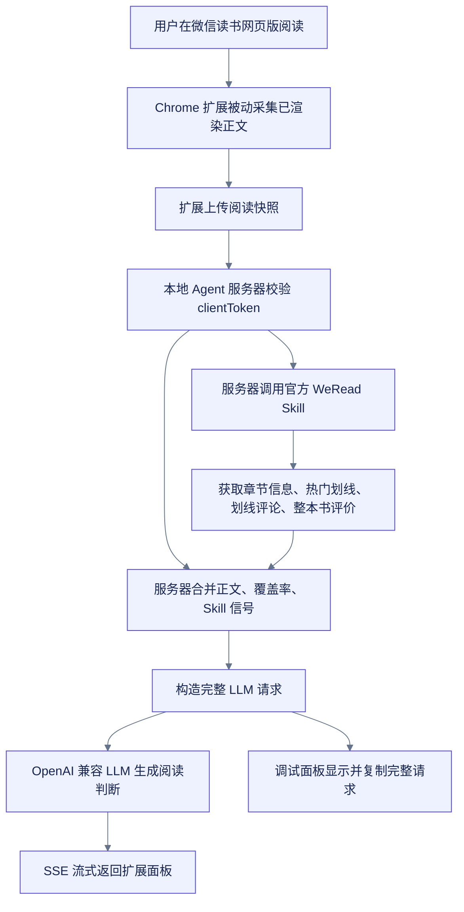

# WeRead AI Reader

微信读书网页版的实时 AI 跟读助手。它把 Chrome 扩展在当前阅读页被动采集到的正文片段，和官方 WeRead Skill 返回的整本书评价、本章热门划线、划线评论一起交给本地 Agent 服务器，再由 LLM 给出实时的本章阅读价值判断。

## 它解决什么问题

微信读书官方 Skill 能拿到很有价值的读者信号，例如热门划线、划线评论和书评，但拿不到当前章节正文。这个项目用 Chrome 扩展补上浏览器侧可见正文，再交给服务器统一组织 Agent 请求，判断这一章是否值得精读、为什么、重点段落在哪里，以及评论区有什么共识或争议。

当前实现刻意采用非打扰式采集：扩展只收集微信读书自然渲染出来的正文，不主动翻页、不滚动、不跳章节。因此低覆盖率时，Agent 会明确把结论标成阶段性建议，而不是假装已经读完整章。

## 流程图



## 项目结构

| 路径 | 用途 |
|------|------|
| `extension/` | Chrome 扩展，负责页面采集、设置页、弹窗和阅读面板 |
| `server/` | 本地 Agent 服务器，负责 WeRead Skill、LLM、缓存、SSE |
| `test/` | Node 内置测试，覆盖快照上传、信号聚合、Agent 请求和流式判断 |
| `docs/adr/` | 架构决策记录 |
| `CONTEXT.md` | 项目上下文、术语和设计约束 |

## 准备条件

- Node.js 18 或更新版本
- Chrome
- 微信读书网页版登录态
- 官方 WeRead Skill API Key
- OpenAI 兼容的 LLM API Key

## 启动服务器

```bash
npm install

export WEREAD_API_KEY="wrk-..."
export LLM_API_KEY="sk-..."
export LLM_API_BASE="https://opencode.ai/zen/go/v1"
export LLM_MODEL="deepseek-v4-flash"
export CLIENT_TOKEN="change-me"
export PORT="19763"

npm start
```

健康检查：

```bash
curl http://127.0.0.1:19763/health
```

## 安装 Chrome 扩展

1. 打开 `chrome://extensions`。
2. 开启开发者模式。
3. 点击“加载已解压的扩展程序”。
4. 选择本仓库的 `extension/` 目录。
5. 打开扩展设置页，填写 Agent 服务器地址和 `CLIENT_TOKEN`。

本地默认地址是 `http://127.0.0.1:19763`，默认开发令牌是 `dev-token`。如果服务器环境变量里改了 `CLIENT_TOKEN`，扩展设置页也要同步修改。

## 使用方式

1. 打开微信读书网页版阅读页，例如 `https://weread.qq.com/web/reader/...`。
2. 页面右侧会出现 `WeRead AI` 面板。
3. 翻到新章节或点击“本章判断”，扩展会上传当前阅读快照。
4. 面板上方流式显示阅读判断，下方证据区展示官方 Skill 信号。
5. 调试区域可以查看摘要，并复制“完整请求”，用于确认发给 Agent/LLM 的实际内容。

面板最小化后只显示 `AI`，按 `Option+Q` 可以展开面板。

## 数据和密钥边界

- WeRead API Key 和 LLM API Key 只放在服务器环境变量里。
- Chrome 扩展只保存服务器地址和 `clientToken`。
- `clientToken` 是扩展访问 Agent 服务器的共享访问令牌，需要和服务器环境变量 `CLIENT_TOKEN` 一致；它不是 WeRead 或 LLM API Key。
- 调试输出会隐藏 LLM Authorization，不会把服务端密钥返回给浏览器。
- 当前服务器是单用户开发形态，`clientToken` 是未来多用户隔离的协议边界。

## 当前限制

- 官方 WeRead Skill 不提供章节正文接口。
- 正文来自浏览器已渲染内容，采集覆盖率取决于用户自然阅读过多少页面。
- 扩展不会为了“全章采集”自动滚动、翻页或跳转，以免影响阅读体验。
- 覆盖率不足时，AI 只能做阶段性建议，并会更多依赖热门划线、评论和书评信号。

## 开发验证

```bash
npm test
node --check server/createApp.js server/index.js server/llmClient.js server/wereadClient.js test/agent-server.test.js extension/background.js extension/content.js extension/canvas-hook.js extension/options.js extension/popup.js
```

加载扩展后的端到端验证建议在单独的微信读书测试窗口进行，避免干扰正在阅读的页面。
