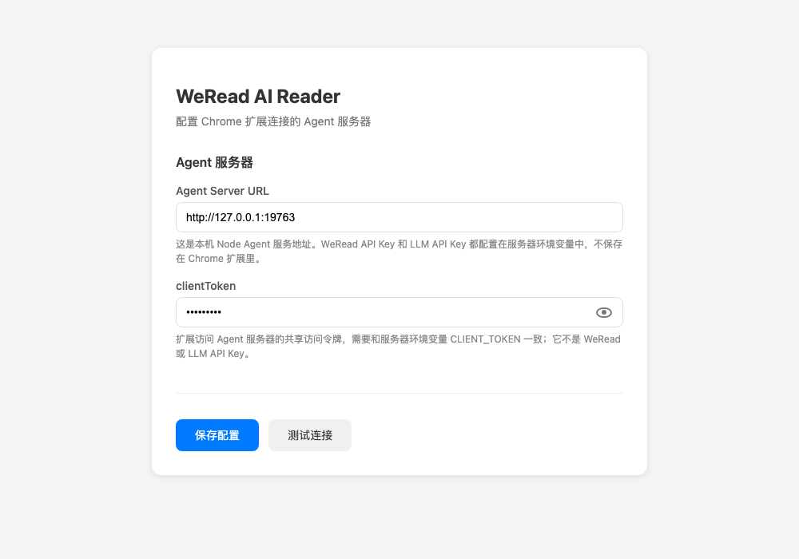
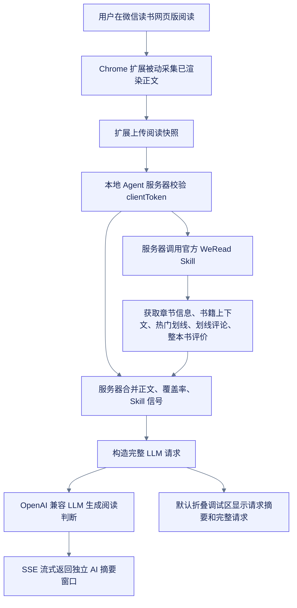

# WeRead AI Reader

微信读书网页版的实时 AI 跟读助手。它把 Chrome 扩展在当前阅读页被动采集到的正文片段，和官方 WeRead Skill 返回的书籍上下文、整本书评价、本章热门划线、划线评论一起交给本地 Agent 服务器，再由 LLM 给出实时的本章阅读价值判断。

## 它解决什么问题

微信读书官方 Skill 能拿到很有价值的读者信号，例如书籍信息、阅读进度、热门划线、划线评论和书评，但拿不到当前章节正文。这个项目用 Chrome 扩展补上浏览器侧可见正文，再交给服务器统一组织 Agent 请求，判断这一章是否值得精读、接下来最需要掌握什么、应该带着哪些问题读，以及评论区有什么共识或争议。

当前实现刻意采用非打扰式采集：扩展只收集微信读书自然渲染出来的正文，不主动翻页、不滚动、不跳章节。因此低覆盖率时，Agent 会明确把结论标成阶段性建议，而不是假装已经读完整章。

## 界面形态

阅读页不再注入可见 AI 小框，避免遮挡或压缩正文。扩展工具栏 popup 是控制台：打开或聚焦独立 AI 摘要窗口、触发“本章判断”、查看短状态、进入设置和清理缓存。按 `Option+Q` 也会打开或聚焦独立 AI 摘要窗口。

AI 摘要窗口展示极简首屏：精读/快读/跳读结论、掌握价值分、最多 3 个最需要掌握点、最多 2 个带着读的问题、一句阅读动作，以及 Agent 归纳出的读者视角、理由和重点段落。WeRead 原始信号单独放在默认展开的“阅读信号”框里；“调试”默认折叠，只包含请求摘要和完整请求。窗口内也保留一个次级“本章判断”按钮。扩展图标 badge 只显示短状态：`…` 表示生成中，`OK` 表示完成，`!` 表示失败。

设置页配置本地 Agent 服务地址和 `clientToken`，clientToken 可以通过小眼睛临时显示。



## 流程图



## 项目结构

| 路径 | 用途 |
|------|------|
| `extension/` | Chrome 扩展，负责页面采集、工具栏 popup、独立摘要窗口和设置页 |
| `server/` | 本地 Agent 服务器，负责 WeRead Skill、LLM、缓存、SSE |
| `test/` | Node 内置测试，覆盖快照上传、信号聚合、Agent 请求和流式判断 |
| `docs/adr/` | 架构决策记录 |
| `CONTEXT.md` | 项目上下文、术语和设计约束 |

## 准备条件

- Node.js 18 或更新版本
- Chrome
- 微信读书网页版登录态
- 官方 WeRead Skill API Key
- OpenAI 兼容的 LLM API Key

## 启动服务器

```bash
npm install

export WEREAD_API_KEY="wrk-..."
export LLM_API_KEY="sk-..."
export LLM_API_BASE="https://opencode.ai/zen/go/v1"
export LLM_MODEL="mimo-v2.5"
export LLM_FALLBACK_MODELS="kimi-k2.6,kimi-k2.5"
export CLIENT_TOKEN="change-me"
export ENABLE_PERSONAL_SIGNALS="false"
export PORT="19763"

npm start
```

`LLM_MODEL` 是首选模型。`LLM_FALLBACK_MODELS` 是可选的逗号分隔列表；当首选模型遇到 429、`fetch failed`、空输出或结构化解析失败时，Agent 会继续用同一个 `LLM_API_BASE` 和 `LLM_API_KEY` 尝试下一个模型。这个 fallback 只在当前 OpenCode Go 兼容接口内部切换模型，不切换到其它 provider 或其它密钥。

健康检查：

```bash
curl http://127.0.0.1:19763/health
```

## 安装 Chrome 扩展

1. 打开 `chrome://extensions`。
2. 开启开发者模式。
3. 点击“加载已解压的扩展程序”。
4. 选择本仓库的 `extension/` 目录。
5. 打开扩展设置页，填写 Agent 服务器地址和 `CLIENT_TOKEN`。

本地默认地址是 `http://127.0.0.1:19763`，默认开发令牌是 `dev-token`。如果服务器环境变量里改了 `CLIENT_TOKEN`，扩展设置页也要同步修改。

## 使用方式

1. 打开微信读书网页版阅读页，例如 `https://weread.qq.com/web/reader/...`。
2. 点击 Chrome 工具栏里的 WeRead AI 扩展图标。
3. 在 popup 中点击“打开摘要窗口”，或按 `Option+Q` 打开独立 AI 摘要窗口。
4. 翻到新章节会自动上传当前阅读快照；需要手动刷新时，在 popup 或摘要窗口点击“本章判断”。
5. 摘要窗口流式显示阅读判断；默认展开的“阅读信号”展示热门划线和整本书评价背景，默认折叠的“调试”展示请求摘要和完整请求；扩展图标 badge 同步显示生成、完成或失败状态。

LLM 返回的阅读判断会包含精读/快读/跳读建议、掌握价值分、接下来最需要掌握的内容、追问问题、一句阅读动作、读者视角、理由和重点段落。

## 数据和密钥边界

- WeRead API Key 和 LLM API Key 只放在服务器环境变量里。
- Chrome 扩展只保存服务器地址和 `clientToken`。
- `clientToken` 是扩展访问 Agent 服务器的共享访问令牌，需要和服务器环境变量 `CLIENT_TOKEN` 一致；它不是 WeRead 或 LLM API Key。
- 调试输出会隐藏 LLM Authorization，不会把服务端密钥返回给浏览器。
- 当前服务器是单用户开发形态，`clientToken` 是未来多用户隔离的协议边界。

`ENABLE_PERSONAL_SIGNALS=true` 会把个人划线和个人想法加入章节判断输入。默认关闭时，Agent 只使用公共阅读信号、书籍上下文信号和浏览器采集到的章节正文快照。

## 当前限制

- 官方 WeRead Skill 不提供章节正文接口。
- 正文来自浏览器已渲染内容，采集覆盖率取决于用户自然阅读过多少页面。
- 扩展不会为了“全章采集”自动滚动、翻页或跳转，以免影响阅读体验。
- 覆盖率不足时，AI 只能做阶段性建议，并会更多依赖热门划线、评论和书评信号。

## 开发验证

```bash
npm test
node --check server/createApp.js server/index.js server/llmClient.js server/readingStrategy.js server/signalBuilder.js server/wereadClient.js scripts/benchmark-models.js test/agent-server.test.js test/reading-strategy.test.js test/model-benchmark.test.js extension/background.js extension/content.js extension/canvas-hook.js extension/options.js extension/popup.js extension/summary.js
```

加载扩展后的端到端验证建议在单独的微信读书测试窗口进行，避免干扰正在阅读的页面。

## 模型评测

`scripts/benchmark-models.js` 会复用正式阅读判断的 `readingStrategy`，用固定样本比较不同 OpenAI 兼容模型的速度、JSON 有效性、schema 完整度和自动质量分。

```bash
mkdir -p reports
npm run benchmark:models -- \
  --models mimo-v2.5,kimi-k2.6 \
  --format markdown \
  --timeout-ms 45000 \
  --output reports/model-benchmark.md
```

如果服务商支持 `/models`，可以用 `--models all` 自动拉取模型列表：

```bash
npm run benchmark:models -- --models all --format markdown
```

默认读取 `LLM_API_BASE` 和 `LLM_API_KEY`，样本文件是 `scripts/fixtures/reading-strategy-samples.json`。报告里的 `TTFT Avg` 是首个模型内容 delta 到达时间，`Total Avg` 是完整结构化 JSON 返回并解析完成的时间。
