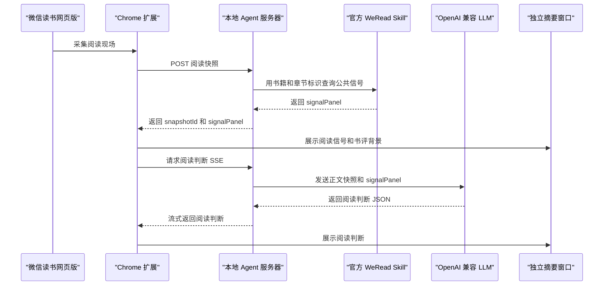

# WeRead AI Reader

> 不只是 AI 摘要，而是辅助思考阅读：帮你看见重点、提出追问、判断章节速读和精读。

微信读书网页版的章节级 AI 跟读工具。Chrome 扩展负责被动采集当前阅读现场，本地 Agent 服务器负责调用官方 WeRead Skill 与 OpenAI 兼容 LLM，独立摘要窗口展示本章阅读判断、阅读信号和整本书评价背景。

## 功能

- 被动采集微信读书网页版已渲染的章节正文，不自动滚动、翻页或跳章节。
- 聚合官方 WeRead Skill 信号：书籍信息、章节目录、阅读进度、热门划线、划线评论和公开书评。
- 生成章节级阅读判断：精读/快读/跳读建议、掌握价值分、重点、追问问题、理由和阅读动作。
- 使用独立摘要窗口展示 AI 结果，阅读页内不注入可见面板。
- 将 WeRead API Key 与 LLM API Key 保留在本地 Agent 服务器，Chrome 扩展只保存服务器地址和 `clientToken`。

## 界面预览


## 架构与数据流



阅读快照不是 WeRead 公共数据本身，而是扩展上传的一次“当前阅读现场”：包括 `bookId`、`bookTitle`、`chapterUid`、`chapterTitle`、URL、已渲染正文片段、内容哈希和采集时间。Agent 服务器用快照里的书籍和章节标识去调用官方 WeRead Skill，查询章节目录、书籍信息、热门划线、划线评论和公开书评，整理成 `signalPanel`；如果 `chapterUid` 缺失，Agent 会尽量用 `bookId + chapterTitle` 从章节目录里补齐。

官方 WeRead Skill 不提供当前章节正文。扩展只负责提供浏览器已渲染的正文快照；随后阅读判断由 LLM 基于“正文快照 + `signalPanel`”生成。独立摘要窗口同时展示阅读判断、阅读信号和整本书评价背景。

## 运行要求

- Node.js 18 或更新版本
- Chrome
- 微信读书网页版登录态
- 官方 WeRead Skill API Key
- OpenAI 兼容 LLM API Key

## 启动 Agent 服务器

创建本地环境变量文件：

```bash
cp .env.example .env
```

至少配置：

```bash
WEREAD_API_KEY=wrk-...
LLM_API_KEY=sk-...
```

`.env.example` 默认使用 OpenCode Go 兼容接口和 `mimo-v2.5`：

```bash
LLM_API_BASE=https://opencode.ai/zen/go/v1
LLM_MODEL=mimo-v2.5
LLM_FALLBACK_MODELS=kimi-k2.6,kimi-k2.5
CLIENT_TOKEN=dev-token
PORT=19763
```

本机启动：

```bash
./scripts/start-server.sh
```

Docker 启动：

```bash
./scripts/start-server.sh --docker
```

npm 快捷命令：

```bash
npm run server
npm run server:docker
```

健康检查：

```bash
curl http://127.0.0.1:19763/health
```

如果 shell 中已经导出 `WEREAD_API_KEY` 和 `LLM_API_KEY`，启动脚本会优先使用当前环境变量。

WeRead API Key 和 LLM API Key 只配置在 Agent 服务器环境变量中，不写入 Chrome 扩展。

## 安装 Chrome 扩展

1. 打开 `chrome://extensions`。
2. 开启开发者模式。
3. 点击“加载已解压的扩展程序”。
4. 选择本仓库的 `extension/` 目录。
5. 打开扩展设置页，填写 Agent 服务器地址和 `CLIENT_TOKEN`。

本地默认地址是 `http://127.0.0.1:19763`，默认开发令牌是 `dev-token`。如果服务器环境变量里改了 `CLIENT_TOKEN`，扩展设置页也要同步修改。`clientToken` 只是扩展访问本地 Agent 服务器的共享令牌，不是 WeRead 或 LLM API Key。

## 使用

1. 打开微信读书网页版阅读页，例如 `https://weread.qq.com/web/reader/...`。
2. 点击 Chrome 工具栏里的 WeRead AI 扩展图标。
3. 点击“打开摘要窗口”，或按 `Option+Q` 打开独立摘要窗口。
4. 翻到新章节后，扩展会上传当前阅读快照并生成阅读判断。
5. 需要重新生成时，在 popup 或摘要窗口点击“刷新阅读判断”。

扩展图标 badge 会显示生成中、完成或失败状态。同一章节内正文采集增长时，扩展只更新采集状态，不自动重跑 LLM。

## 阅读判断语义

掌握价值分由服务端按三个维度派生，不采用模型自由输出的总分：

- 内容增量：35%
- 结构关键性：40%
- 精读必要性：25%

读法门槛：

- `90-100`：必须精读
- `80-89`：值得精读
- `65-79`：可快读
- `0-64`：可跳读

`可快读` 结论下，阅读动作只能建议局部精读，不能要求整章必须精读。

## 开发验证

```bash
npm test
node --check server/createApp.js server/index.js server/llmClient.js server/readingStrategy.js server/signalBuilder.js server/wereadClient.js scripts/benchmark-models.js test/agent-server.test.js test/reading-strategy.test.js test/model-benchmark.test.js test/extension-ui-contract.test.js test/start-server-script.test.js extension/background.js extension/content.js extension/canvas-hook.js extension/options.js extension/popup.js extension/summary.js
```

加载扩展后的端到端验证建议在单独的微信读书测试窗口进行，避免干扰正在阅读的页面。

## 当前限制

- 官方 WeRead Skill 不提供章节正文接口。
- 正文来自浏览器已渲染内容，采集覆盖率取决于用户自然阅读过多少页面。
- 扩展不会为了全章采集自动滚动、翻页或跳转。
- 覆盖率不足时，AI 只能做阶段性建议，并会更多依赖热门划线、评论和书评信号。

## 项目结构

| 路径 | 用途 |
|------|------|
| `extension/` | Chrome 扩展，负责页面采集、工具栏 popup、独立摘要窗口和设置页 |
| `server/` | 本地 Agent 服务器，负责 WeRead Skill、LLM、缓存和 SSE |
| `scripts/` | 本地启动和 Docker 启动脚本 |
| `test/` | Node 内置测试，覆盖快照上传、信号聚合、Agent 请求、流式判断和扩展 UI 合同 |
| `docs/adr/` | 架构决策记录 |
| `docs/images/` | README 使用的 UI 截图 |
| `CONTEXT.md` | 项目术语和设计约束 |
